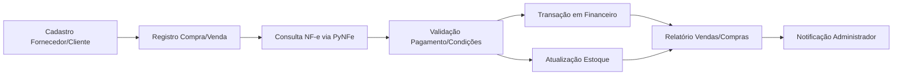
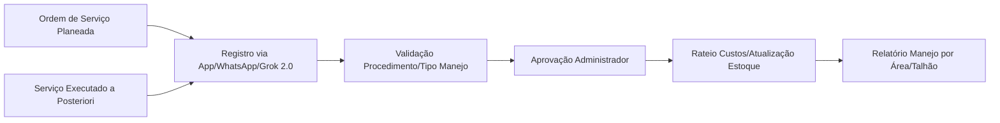
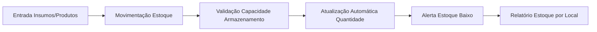
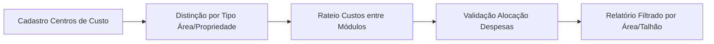

# Fluxogramas dos Módulos do Sistema Agropecuário

Abaixo estão os fluxogramas de cada módulo, descrevendo o fluxo de informações. Copie para [mermaid.live](https://mermaid.live) para visualização.

## Comercial e NF-e


## Financeiro
```mermaid
graph LR
    A[Transações de Outros Módulos] --> B[Registro Conta Pagar/Receber]
    B --> C[Quitação com Anexo/Alerta]
    C --> D[Rateio Custos (Depreciação/Juros)]
    D --> E[Cálculo Fluxo Caixa Real/Projetado]
    E --> F[Relatório por Período]
    F --> G[Alerta Vencimento/Notificação IA]
```

## Agrícola (Manejo)


## Fazendas (Áreas e Talhões)
```mermaid
graph LR
    A[Cadastro Fazenda] --> B[Registro Áreas/Talhões]
    B --> C[Validação Sobreposição/Tamanho (5% tolerância)]
    C --> D[Associação Centros de Custo]
    D --> E[Mapa Interativo (Google Earth)]
    E --> F[Relatório por Área/Talhão]
```

## Estoque


## Administrativo (Centros de Custos)


## Máquinas e Implementos


## Interface (Front-end com IA)
```mermaid
graph LR
    A[Input Usuário (App/Web/WhatsApp)] --> B[Processamento via Grok 2.0]
    B --> C[Aprovação Administrador]
    C --> D[Atualização Módulos (Manejo, Estoque, Financeiro)]
    D --> E[Dashboards / Relatórios]
    E --> F[Notificações / Alertas]
    F --> A
```

## Fluxograma Geral
```mermaid
graph LR
    A[Fazendas (Áreas/Talhões)] --> B[Agrícola (Manejo)]
    A --> C[Máquinas/Implementos]
    B --> D[Estoque]
    B --> E[Administrativo (Centros de Custo)]
    C --> B
    D --> F[Comercial / NFE]
    E --> G[Financeiro]
    F --> G
    H[Módulo Interface / IA] --> A
    H --> B
    H --> F
    H --> G
    G --> H
```